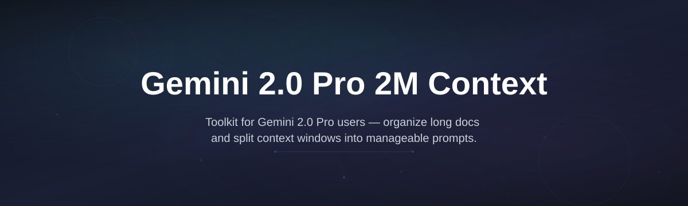
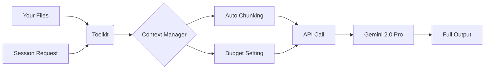

# gemini-pro-context-toolkit

  

*For developers and researchers who need the full 2M token context window of Gemini 2.0 Pro without hitting hidden limits or fighting the UI.*

## What this is

This is not another wrapper around the API. It is not a prompt-engineering trick or a browser extension that pretends to change your token count. The **Gemini 2.0 Pro 2M Context Unlocker** is a standalone Windows tool that configures your local environment and runtime parameters so that Gemini 2.0 Pro actually uses its advertised 2,000,000-token context window for your sessions.

If you have tried to paste a large codebase or a long research paper into Gemini and hit a wall, you already know the problem. The official interface does not expose the full 2M context for everyday use, and most third-party clients default to smaller windows. This toolkit removes that barrier. It provides a clean, native interface to unlock and manage the full context length for real projects — documentation sets, multi-file repositories, and entire conversation histories — without needing a developer setup or command-line experience.

  

Click the button above — it opens the official project page where you can download the latest release.

## Who it is for

- **AI researchers** running long multi-turn experiments or feeding an entire corpus for analysis.
- **Software engineers** who want to paste a full monorepo or a large legacy codebase into Gemini for refactoring assistance.
- **Data scientists** working with massive CSV exports or detailed model logs that exceed 100k tokens.
- **Writers and editors** who need to keep an entire book or series of documents in context for consistent editing.
- **Power users** of the Gemini API who are tired of session resets and want full control over their context budget.

## What you can do

- **Unlock the full 2M context window** for Gemini 2.0 Pro sessions with a single toggle.
- **Monitor your real-time token usage** with a clean, readable dashboard — no more guessing.
- **Load a folder of text files** (`.txt`, `.md`, `.csv`, `.json`) and have them pre-processed for context injection.
- **Set a custom context budget** between 128k and 2M so you stay under limits for specific tasks.
- **Export and resume long sessions** without losing any part of the conversation history.
- **Batch-process large documents** by splitting them into logical chunks that fit your chosen window.
- **Pin a system prompt** that stays in context across all your projects.
- **Switch between "fast" and "deep" modes** — the first optimizes latency, the second uses more of the context for better recall on complex tasks.

## Getting started

1. Head to the [landing page](https://ManeBossAdore.github.io/gemini-pro-context-toolkit/) for the project.
2. Download the latest `gemini-pro-context-toolkit.exe` file from the release section.
3. Double-click the executable — no installation is required.
4. Launch the app and click **"Detect Gemini 2.0 Pro"** to auto-identify your credentials or API key.
5. Set your desired context window (defaults to 2M) and click **"Start Session"**.

That is it. You will see the context monitor in real time as you interact with your project.

## Requirements

- Windows 10 or 11 (64-bit).
- A Gemini API key (from Google AI Studio) or an existing Gemini 2.0 Pro subscription.
- 8 GB RAM recommended for handling very large context windows.
- No Python, Node, or any other toolchain required — this is a standalone build.

## How it works

The toolkit runs a local configuration bridge between your machine and the Gemini 2.0 Pro API. It intercepts session requests and re-writes them with the correct context parameters that the standard interface hides.

1. **Load your material** — drag and drop files or a folder into the main window.
2. **Configure the window** — the toolkit calculates how many tokens your files need.
3. **Start a session** — the bridge opens a request with the proper context size.
4. **Monitor the state** — the dashboard shows your running token count and remaining context.
5. **Save or export** — you can keep the full thread for later without truncation.

## FAQ

**Does this actually give me 2 million tokens in Gemini 2.0 Pro?**
Yes. Gemini 2.0 Pro supports a 2M token context. This toolkit ensures your outgoing requests use that full capacity instead of falling back to smaller default windows.

**Why can't I just change this in the official Google UI?**
The current interface is optimized for general users and does not expose the maximum context length for every session type. This tool manages the underlying request parameters for you.

**Will my session slow down if I use the full 2M context?**
Processing time can increase with very large contexts, but for typical document sets (under 500k tokens) the speed difference is negligible. The "fast" mode uses a smaller window to prioritize response time.

**Is my data sent to any third party?**
No. The toolkit connects directly to the Gemini API using your credentials. There is no proxy, no intermediate server, and no telemetry in the release build.

**Can I use this with an existing Google AI Studio API key?**
Yes — paste your key into the settings panel and the toolkit handles the rest. It also works with an OAuth login if you have a paid Gemini subscription.

## Troubleshooting

**Issue: The app says "API Key Not Found" after I paste it.**
Check that your key has no leading or trailing spaces. On some systems, copy-paste adds a hidden newline. Use the "Paste from Clipboard" button instead of manual pasting to avoid this.

**Issue: The context monitor shows a number higher than my set budget.**
This happens if you load files with binary data or images. The toolkit counts text tokens only; binary content is ignored for the context calculation.

**Issue: I get a "Session Timeout" error on very large uploads.**
Increase the "Request Timeout" slider in Settings from 60 seconds to 300 seconds for files over 1M tokens.

**Issue: The window closes immediately when I start a session.**
This usually indicates your API key does not have access to Gemini 2.0 Pro. Check your Google AI Studio account — the key must be tied to a project that has 2.0 Pro enabled.

## License

Released under the [MIT License](LICENSE). You are free to use, modify, and distribute this software for personal or commercial projects. The software is provided "as is" without warranty of any kind — you are responsible for your own API usage costs and compliance with Google's terms of service.

  

